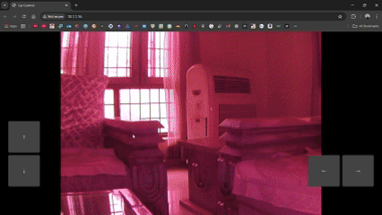

# IoT-Camera-Bot
A DIY Raspberry Pi-powered robot car controlled through a web browser interface with real-time video streaming. Built using Flask, WebSockets, GPIO, and Picamera2 — no external controllers or apps needed!
<br><br>
## Table of Contents
- [About the project](#about-the-project)
- [Dependencies](#dependencies)
- [How it works?](#how-it-works)
- [Enable as a Service](#enabling-script-as-a-service-to-start-at-boot)
<br><br>
## About the project
This project runs on a Raspberry Pi Zero 2 W with Raspberry Pi OS 64-bit installed. Despite its small size and low power usage, this Pi packs enough performance to handle a basic video stream and control a 4WD robotic car. 

To ensure a smooth and steady video feed, I don't rely on the Pi's internal Wi-Fi. Instead, I use a TP-Link AC1300 USB Wi-Fi adapter, which supports 5GHz networks. This allows a faster and more stable connection between the Raspberry Pi and my home network.


The Raspberry Pi connects to my home Wi-Fi using the TP-Link adapter, not the built-in one. I initially used the desktop GUI to set it up, but later switched to CLI-only mode to improve performance by freeing up resources.
<br><br>
## Dependencies
Here are the packages required to run this script
```
sudo apt update && sudo apt install -y \
python3 \
python3-flask \
python3-picamera2 \
libcamera-dev \
python3-pil \
python3-numpy \
python3-gpiozero \
python3-rpi.gpio
```
With Raspberry Pi OS Bookworm or later, the "enable camera" option in `raspi-config` has been removed, so make sure you have a working camera that you can access via
```
rpicam-hello
```
## How it works?
The video feed isn’t technically a live stream. Here's what happens: the camera captures raw frames, which are not natively web-compatible. Each frame is converted to MJPEG format and served in sequence through a browser. So you're actually watching a rapid slideshow of JPEGs, not a continuous video.



The bot uses a night vision camera, but any standard Pi-compatible cam should work. I'm using an L298N motor driver to drive a 4WD chassis. Motors on the left and right sides are paired for control simplicity. Power comes from a 2S 18650 battery pack, providing 8.4V. Due to voltage drop (~2V) across the BJT-based L298N, a higher input voltage helps maintain motor speed. If you're prioritizing efficiency, consider switching to a MOSFET-based H-bridge. The Pi itself draws power from a separate 5V power bank module to keep things stable.

## Youtube Video (Bot in Action)
[](https://www.youtube.com/watch?v=AO5V8Ow4blY)

<br><br>
## Enabling script as a service to start at boot
To make the project plug-and-play, I created a systemd service that automatically starts the main control script at boot. This way, the Pi is ready to go without needing SSH or manual intervention every time.

Create a service file
```
sudo nano /etc/systemd/system/remote.service
```
Paste this template and replace the path for your case
```
[Unit]
Description=Bot Script
After=network.target

[Service]
WorkingDirectory=/path/to/your/clone
ExecStart=/usr/bin/python3 /path/to/your/clone/remote.py
User=root
Restart=always

[Install]
WantedBy=multi-user.target
```
Reload systemctl and enable the service
```
sudo systemctl daemon-reload && sudo systemctl enable remote.service
```
Finally, start the script
```
sudo systemctl start remote
```

The script hosts web server on port 80 by default but if you want to change it, you can set that in line 78 in remote.py
